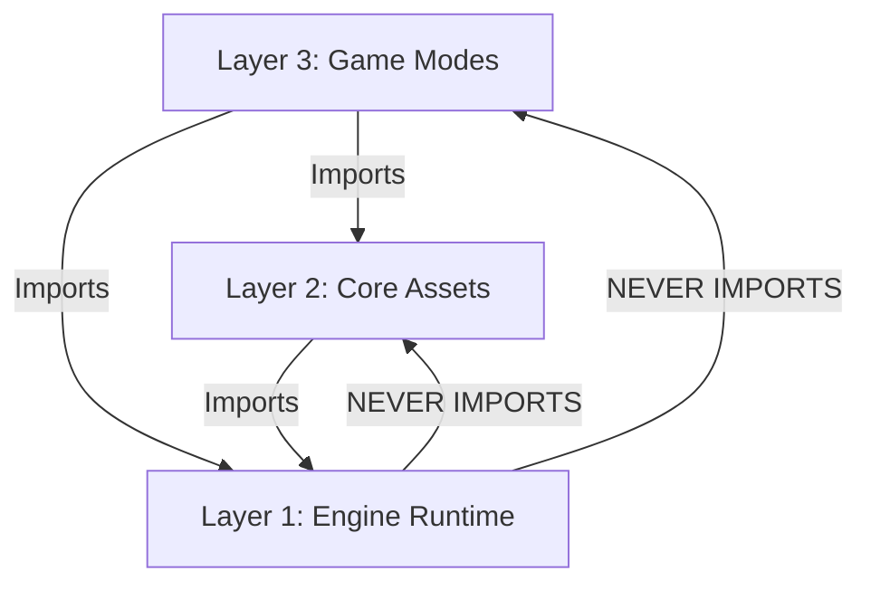

# SYSTEM ARCHITECTURE: PROJECT ORBITAL (2026 REVISION)

## A. THE PHILOSOPHY: "3-LAYER DIAMOND"
The application is structured into three strictly isolated layers. The goal is **ZERO CONTEXT LEAKAGE**. An agent working in a Game Mode should never need to read the Engine source code.

### 1. The Dependency Graph (Strict Unidirectional)


---

## B. THE LAYERS (DETAILED)

### Layer 1: The Engine (`src/engine/`)
**Role:** The "Black Box" Runtime.
**Definition:** Contains infrastructure that is genre-agnostic. It does not know what a "Plane" is. It only knows "RigidBody", "InputDevice", and "Camera".

#### 1.1. Kernel (`src/engine/kernel/` & `src/engine/input`)
*   **Loop.ts**: Manages the `requestAnimationFrame` cycle.
    *   *Constraint:* Enforces Fixed Timestep for Physics to ensure deterministic behavior.
    *   *Rule:* Pure TypeScript class. No React dependencies.
*   **Time.ts**: Handles Delta Time (`dt`) and Clock synchronization.
*   **InputManager**: Normalizes distinct input sources (Mouse, Touch, Keyboard) into a unified `InputState`.
    *   *Responsibility:* Maps raw device events to abstract Actions (e.g., "FIRE", "PITCH").

#### 1.2. Simulation (`src/engine/sim/`)
*   **PhysicsWorld.ts**: Wrapper around `rapier3d-compat` (Raw).
    *   *Constraint:* DO NOT use `@react-three/rapier` components (`<RigidBody>`) for game logic.
    *   *Constraint:* Simulation runs at a fixed tick rate. Uses Mutable State (TypedArrays) for performance.
    *   *API:* Exposes `PhysicsWorld.world` for read-only access.
*   **WorldState.ts**: The central data store for all entities.
    *   *Contract:* Entities must implement `update(dt)` to be ticked.
*   **FloatingOrigin**: Manages coordinate system rebasing.
    *   *Logic:* Shifts the world center when the player moves > 5000 units from (0,0,0) to prevent floating-point jitter.

#### 1.3. Rendering (`src/engine/render/`)
*   **SceneRoot.tsx**: The React-Three-Fiber entry point.
    *   *Responsibility:* Dumb container. Initializes WebGL/Physics.
    *   *Action:* Receives `activeMode`, `cameras`, and `config` from props. Renders `<activeMode.SceneComponent />`.
*   **ViewportSystem/**: Handles Split-Screen logic.
    *   *Abstraction:* Takes `N` cameras from the Mode and renders them to `N` divs using Stencil/Scissor tests.
*   **ViewSync**: Components that read from `WorldState` inside `useFrame` to update 3D objects.
    *   *Rule:* Components here READ from the Sim layer. They do not hold game logic. They purely reflect current state.

#### 1.4. Session (`src/engine/session/`)
*   **SessionState.ts**: Manages "Who is here".
    *   *State:* `players: [{ id: 0, inputDevice: 'gamepad:0' }]`.
    *   *Responsibility:* Assigns Input Devices to Player IDs and handles Join/Leave logic.
*   **NetworkManager.ts**: Manages Socket.IO connection.
    *   *Action:* Syncs generic byte arrays for `RemoteEntity` replication. Does not decode Game Logic.

---

### Layer 2: The Core (`src/app/core/`)
**Role:** The "Standard Library" (Assets).
**Definition:** Reusable assets that encapsulate implementation details (Math, Visuals, Configs).

#### 2.1. Entities (`src/app/core/entities/`)
*   **Airplane/**:
    *   `AirplaneSim.ts`: The Flight Physics Model.
    *   `AirplaneView.tsx`: The 3D Mesh & Particles.
    *   `AirplaneConfig.ts`: Stats (Speed, Turn Rate).

#### 2.2. Environment (`src/app/core/env/`)
*   `BlueprintSphere.tsx`: The standard Grid-Planet mesh.
*   `SunLight.tsx`: Standard lighting setup.

#### 2.3. Input (`src/app/core/input/`)
*   `DefaultProfiles.ts`: Exports `StandardFlightProfile` (Stick=Pitch/Roll) & `StandardMenuProfile`.

#### 2.4. Cameras (`src/app/core/cameras/`)
*   `ChaseCamera.tsx`: Standard 3rd-person camera with spring arm logic.
*   `OrbitCamera.tsx`: Menu camera for inspecting objects.

---

### Layer 3: The Modes (`src/app/modes/`)
**Role:** The "Application".
**Definition:** The specific rules that bind Engine and Core together.

#### 3.1. The `GameMode` Interface
Every Mode must export this contract:
```typescript
interface GameMode {
  id: string; // e.g. "free_flight"
  SceneComponent: React.FC; // Renders the World
  UIComponent: React.FC;    // Renders the HUD
  ViewportComponent?: React.FC<{ // Renders the Player View
      player: any,
      cameraRef: any,
      cameras?: Record<string, React.FC<any>>
  }>;
  update: (dt: number) => void; // Runs the Logic
  dispose: () => void; // Cleanup
}
```

#### 3.2. Example: `FreeFlightMode`
*   **SceneComponent**:
    *   Renders `<Core.BlueprintSphere />`.
    *   Renders `<Core.ChaseCamera />`.
    *   Iterates `players` and renders `<Core.AirplaneView />`.
*   **Update Loop**:
    *   Iterates `players`.
    *   Read Input via `SessionState`.
    *   Calls `player.sim.update(dt)`.

---

## C. STATE MANAGEMENT (CONTEXT ISOLATION)

To allow AI Agents to work without breaking other modes, we enforce **State Sharding**.

### 1. Global Store (`useStore.ts`)
*   **Scope:** User Preferences & Hardware.
*   **Allowed Data:** Volume, Graphics Settings, Input Bindings, Debug Flags.
*   **Forbidden Data:** Score, Health, Projectiles, Game Phase.

### 2. Session Store (`SessionState.ts`)
*   **Scope:** The Setup.
*   **Data:** Connected Controllers, Player Colors, Network Latency.

### 3. Mode Store (Local to Mode)
*   **Scope:** The Gameplay.
*   **Pattern:** Each Mode folder has its own store (e.g., `useCaptureTheFlagStore`).
*   **Data:** Flags Captured, Respawn Timers, Powerups.
*   **Why:** If an AI breaks `useCaptureTheFlagStore`, `FreeFlightMode` is unaffected.

---

## D. EXTENSIBILITY PATTERNS

### 1. Adding a New Entity (e.g., Tank)
*   **Step 1 (Vibe Coding):** Create `src/app/modes/TankMode/TankSim.ts`.
    *   Implement usage within `TankMode`.
*   **Step 2 (Canonization):** Move to `src/app/core/entities/TankSim.ts`.
    *   Now `CaptureTheFlagMode` can import it too.

### 2. Adding a New Input
*   **Step 1:** Define `TankProfile` object in `TankMode.tsx`.
*   **Step 2:** Register it: `InputManager.registerProfile('TANK', TankProfile)`.
*   **Step 3:** Assign it: `player.input.setProfile('TANK')`.

---

## E. FILE STRUCTURE REFERENCE
```text
src/
├── engine/                 # [Layer 1] The Runtime
│   ├── kernel/             # Loop, Time
│   ├── sim/                # PhysicsWorld (Rapier), WorldState, FloatingOrigin
│   ├── render/             # SceneRoot (Bootloader), ViewSync
│   └── session/            # Network, Input, SessionState
│
├── app/
│   ├── core/               # [Layer 2] The Assets
│   │   ├── entities/       # Airplane, Tank
│   │   ├── cameras/        # ChaseCamera, OrbitCamera (Injected)
│   │   ├── env/            # Planet, Sun
│   │   └── input/          # StandardProfiles
│   │
│   ├── modes/              # [Layer 3] The Games
│   │   ├── FreeFlight/     # FreeFlightMode.tsx, useFreeFlightStore.ts
│   │   ├── MainMenu/       # MainMenuMode.tsx
│   │   └── [NEW MODE]/     # Your AI workspace
│   │
│   └── store/              # Global Prefs (useStore.ts)
```